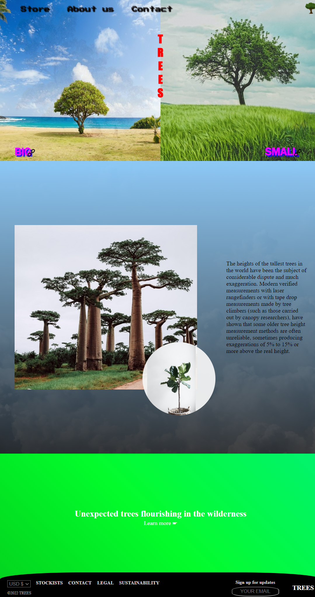

# Trees - Webpage
Trees - Webpage was developed using HTML and CSS with animations.

The webpage shows a template for the main page with a proper header, main and 
footer section. All items can be easily adjusted, and this webpage can serve as 
a template layout for further projects.  

**Example view:** 

***The home page.*** 
 
